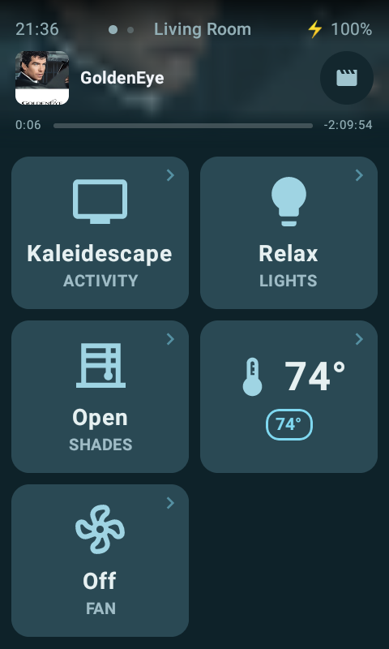
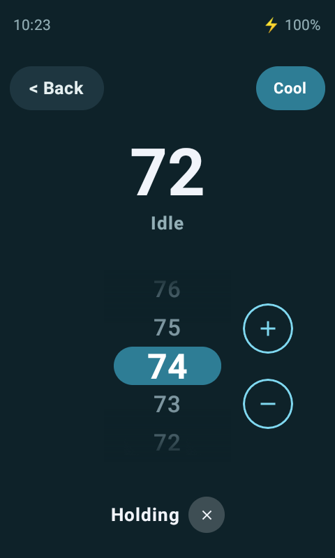

# Astrion Custom — a standalone Home Assistant UI for the Sanytron Astrion HA100

A from-scratch Android app that **replaces** the stock `HaRemote` UI on the
Astrion HA100 remote with a fully custom, extensible interface you control end
to end.

It connects directly to Home Assistant over the standard WebSocket API, renders
whatever cards and layouts you define, and maps the remote's physical buttons to
any action you want. Nothing depends on Sanytron's cloud or their HA integration
— only a reachable HA instance and a long-lived token.

It also runs on **an ordinary Android tablet**, from the same APK and the same
layout document — a wall panel and a handheld remote off one configuration. What
a tablet needs is presentation, not a second layout: lanes, a scale factor, a
D-pad drawn on screen because there are no buttons to press, and kiosk lock so
it cannot be swiped out of. See
[Bigger screens](docs/FORK_ADDITIONS.md#bigger-screens-columns-scale-and-kiosk).

> **This is a fork** of [baes-cloud/astrion-dashboard](https://github.com/baes-cloud/astrion-dashboard).
> Jump to **[what this fork changes](#what-this-fork-changes)**.

---

## Screenshots

| Main page | Activity selector | Now playing |
|---|---|---|
|  |  |  |

| Display section | Volume overlay | Mute overlay |
|---|---|---|
|  |  |  |

| Status page | …continued | Settings sheet |
|---|---|---|
|  |  |  |

| Climate card | Temperature picker | Mode selector |
|---|---|---|
|  |  |  |

The climate card shows the current temperature, the setpoint, what the system is
doing right now, and — when a `hold_entity` is configured — a Holding chip whose
⊗ resumes the schedule. Tapping anywhere on the card opens the picker; the mode
button sits inline beside the wheel rather than in a corner, so the numbers stay
on the dialog's centre line.

| Select with sliders | Fan speeds | Source latch |
|---|---|---|
|  |  |  |

Dropdowns are themed to match the app, and a `select` card can carry brightness
sliders for the lights its options adjust. Compose takes menu and dialog colours
from `MaterialTheme` rather than from the caller, so without the app's own theme
these arrive in the default *light* palette on a dark dashboard.

The third shot shows a `select` pill with a **latch button**: several cards share
one entity, so latching one releases the others. Here it decides which pane of a
multi-view video wall the remote's physical keys drive — the card just writes a
value, and Home Assistant decides what the keys do with it.

| Now-playing strip | App / channel launcher | Library picker |
|---|---|---|
|  |  |  |

A compact now-playing strip — art, title, launcher, no transport — because the
full panel pushed the rest of the page off a 480×800 screen for something you
only glance at. Its progress bar sits below the card and appears only when the
source actually reports a duration.

The launcher is one full-screen picker shared by three hosts (a pill on the
page, a select row's trailing slot, the D-pad's corner). Each item names its own
service, so one list can both open a streaming app and deep-link a channel, and
it acts on whichever device the keys are currently driving. The third shot is
the same picker with `columns: 1` — buttons and a several-hundred-row list in
one scroll, with an A–Z rail you drag rather than 27 targets you cannot hit.

### On a tablet


The same layout on a 10" tablet: three lanes, a drawn D-pad, kiosk-locked. The
document is unchanged — only `ui:` differs.

The layout behind these shots is [`examples/dashboard.yaml`](examples/dashboard.yaml)
— a real, in-use configuration rather than a toy one.

### Optional: bigger touch points




A 3" screen at arm's length does not give a scrolling card list much of a
chance. Adding a `dock_cards:` key to a page renders it as a 2-wide grid of
large buttons instead — roughly five times the target area, each one showing
what its thing is currently doing, so most glances need no tap at all. Tapping
one opens a submenu of equally large buttons; swipe right to come back.

It is per page and entirely opt-in: a page without `dock_cards:` is unchanged,
so you can convert one room and live with it before deciding. **But where it is
present it wins outright** — that page's own `cards:` list becomes unreachable
rather than acting as a fallback, so anything you still want must appear in the
new list too.

**Nothing on the page moves.** That turned out to be the hard part, and most of
the design follows from it:

- The top band is **reserved whether or not anything is playing**, so the
  buttons sit in the same place in a silent room as in a loud one. What is
  playing goes in that band, with the clock and battery drawn over it; when
  nothing is, a `weather_header` fills it.
- A submenu is drawn **over** the index, not in place of it. The index stays
  mounted and unmoved underneath, so backing out uncovers it rather than
  rebuilding it — and the now-playing header cannot snap into view, because it
  never left.
- A now-playing title is one line with a marquee rather than wrapping, which is
  what makes that band the same height across sources: one publishes a bare
  title, another a long title *and* an app name it uses as a subtitle.


Layout: [`examples/dashboard-dock.yaml`](examples/dashboard-dock.yaml).
Supporting template sensors: [`homeassistant/templates-dock.yaml`](homeassistant/templates-dock.yaml).

---

## What this fork changes

All additive: the upstream architecture (an open `CardRegistry`, a document-driven
layout) is unchanged. Each item below landed as its own commit.

| Area | Change |
|---|---|
| **New cards** | `separator`, `bubble_select`, `shade_control`, `bubble_climate`, `conditional`, `dpad`, `dock_menu`, `weather_header` |
| **Big-touch layout** | *optional* — add `dock_cards:` to a page and it renders as a 2-wide grid of large buttons with live state on every tile, nested menus, and swipe-right-to-go-back. Pages without it are unchanged. See [`examples/dashboard-dock.yaml`](examples/dashboard-dock.yaml) |
| **Changed cards** | `bubble_climate` rebuilt (hold indicator, mode + dual setpoints, scrolling picker), brightness sliders and a radio latch button inside `bubble_select`, `media_player` transport rework + auto-collapse + stale-metadata guard, `monitor` attribute rows, `button_grid` selected state, `fan` tile restyle |
| **Hotkeys** | corrected HA100 keycode map, `scroll_to` a section, `open_on` auto-opens a selector, `action: sync` |
| **Configuration** | credentials out of the APK, a setup web server, layout sync from Home Assistant, a device panel, per-remote start page, tilt-based motion wake and dock display |
| **Voice** | the VOICE key streams the mic to an endpoint you configure; ends on silence |
| **Input bridge** | screen-off keys via a direct `/dev/input` reader, and a `/system/etc/init` boot hook that starts it (and re-enables adb-TCP) unattended on every boot |
| **UI** | dark theme so menus and dialogs stop arriving white, press feedback on controls that answer late, transient volume / mute overlay, voice indicator |
| **Bigger screens** | runs on modern Android and on a tablet from the same APK: `ui.columns` lanes, `ui.scale`, `ui.padding`, landscape lock, a drawn `dpad`, kiosk lock with a PIN-gated exit |
| **Launchers** | one shared full-screen picker: curated `items:` where each entry names its own service, `target_from:` resolved at tap time so a launcher follows the device you are driving, mixed button/list sections, an A–Z fast-scroller |
| **Layout server** | `page_cards:` and `page_hotkeys:` merge per-device changes into a named page instead of restating it |
| **Build** | signed, R8-minified release (16 MB → 1.3 MB), bounded Gradle heap |
| **Performance** | filtered entity subscription, per-key entity observation, card-level pass |

**→ [docs/FORK_ADDITIONS.md](docs/FORK_ADDITIONS.md)** documents every new card
and config option with JSON examples, and reports the performance work with the
on-device measurements behind it — including one pass that measurably *didn't*
help.

**→ [docs/HARDWARE_NOTES.md](docs/HARDWARE_NOTES.md)** records faults found in the
HA100 units themselves, with the commands to check your own — starting with an
accelerometer that reports 1.9 g at rest on one of ours.

---

## Install

### 1. Get at the USB-C port

The HA100's USB-C port hides under the plastic strip on the bottom edge.
**Undo the two small screws** and lift the strip off:

> **If you leave the strip off, check the remote seats flush in its dock.**
> Without it the pogo pins can make partial contact — enough for the charger to
> be *detected*, not enough to charge. One here drained from 93% to flat
> overnight reporting `AC powered: true` throughout. See
> [docs/HARDWARE_NOTES.md](docs/HARDWARE_NOTES.md#dock-with-the-usb-c-cover-removed-the-pins-only-meet-when-seated-flush).


### 2. Enable developer options

On the remote: **Settings → About → tap Build number 7×**, then
**Settings → Developer options → USB debugging**. With a cable connected:

```sh
adb devices        # the remote should be listed
```

Optionally switch to wireless adb so the cable isn't needed again. On its own
this does **not** survive a reboot — redo it over USB if the remote restarts, or
install the [boot hook](boot-hook) (see step 5) to make both wireless adb and the
input bridge come back automatically on every boot:

```sh
adb tcpip 5555
adb connect <remote-ip>:5555
```

### 3. Install the app

Either works; the difference only matters later. The prebuilt APK renders every
card type this fork ships, and layouts are data, so you can go a long way without
a toolchain — but **adding a brand-new card type means compiling** (see
[Add a new native card type](#add-a-new-native-card-type-the-whole-point)).

**Option A — prebuilt release** (signed, minified, ~1.4 MB):

```sh
adb install releases/astrion-custom-1.33.0.apk
```

**Option B — build from source.** You need:

| | |
|---|---|
| JDK | **17** — `JAVA_HOME` must point at it |
| Android SDK | platform **34**, build-tools **34.0.0**, platform-tools |
| Gradle | none, use the bundled wrapper (`./gradlew`) |
| RAM | ~4 GB free; `gradle.properties` caps the heaps for smaller machines |

```sh
cp secrets.properties.example secrets.properties   # may stay blank — see step 5
./gradlew assembleDebug
adb install -r app/build/outputs/apk/debug/app-debug.apk
```

For a **release** build (strongly preferred — debug builds are noticeably slower
on this SoC), create a keystore and add it to `secrets.properties`:

```sh
keytool -genkeypair -keystore release.jks -alias astrion \
  -keyalg RSA -keysize 2048 -validity 10950
```

```properties
releaseKeystore=/path/to/release.jks
releaseKeystorePassword=…
releaseKeyAlias=astrion
releaseKeyPassword=…
```

```sh
./gradlew assembleRelease
adb install -r app/build/outputs/apk/release/app-release.apk
```

> **Keep that key forever.** Android only allows in-place updates when the
> signature matches; a different key means uninstalling first.

### 4. Make it the launcher

The stock `HaRemote` app is a system app **and the device's launcher**. Set this
app as home instead — that single preference is also the biggest battery win
available on this hardware:

```sh
adb shell cmd package set-home-activity com.custom.astrion/.MainActivity
```

`MainActivity` already declares `CATEGORY_HOME`, so it is eligible; the command
just makes it preferred. To go back:

```sh
adb shell cmd package set-home-activity com.aiks.HaRemote/.boot.RemoteApp
```

**Why this matters beyond convenience.** The stock app holds a
`PARTIAL_WAKE_LOCK` for as long as it runs — measured here as one unbroken
68-hour hold, meaning the device had never entered deep sleep since boot. With
this app preferred as home the stock app **never starts**: its `boot.RemoteApp`
component is its launcher entry, not an independent boot hook. Verified across a
reboot — the preference survives, Home goes straight to the dashboard, and the
system reports no wake locks held.

> **Do not disable the stock launcher.** It is tempting to go further and run
> `pm disable-user com.aiks.HaRemote`. **Don't.** Disabling the launcher leaves
> the HA100 in a permanent bootloop, and on this hardware safe mode, recovery
> mode and factory reset are all unreachable once that happens — the only way
> back is BROM/preloader mode with SP Flash Tool, signed MediaTek USB drivers
> and firmware from the vendor. At least one owner has bricked a unit this way.
> Setting the home-activity preference reaches the same result, disables
> nothing, and reverts with one command.

Related: **network adb can be made to survive a reboot — see
[`boot-hook/`](boot-hook).** Out of the box it does not: `adb tcpip 5555` sets
only the runtime property, and `persist.adb.tcp.port` is *ignored by this build*
because nothing in it restarts adbd on the TCP port at boot — so after every
reboot you would need USB again. The boot hook does that restart itself (and
starts the input bridge), so once it is installed, adb-over-TCP comes back on its
own and you can leave the cable in the drawer. Without it, treat anything
boot-related as a one-shot test and keep the cable to hand.

#### Prefer to keep the stock launcher?

Bind a hardware key to open this app instead, with
[Key Mapper](https://github.com/keymapperorg/KeyMapper) (FOSS build): trigger on
the Home key (it reports as **`F1`** here), action *Open app → Astrion Custom*,
and constrain it to *HaRemote is in foreground* — without that constraint the
Home key is swallowed everywhere, including inside this app where it is bound to
your own hotkey.


### 5. Keys that work with the screen off — the input bridge

This is the fork's most useful hardware fix, and the least obvious. By default
the press that wakes the screen is **swallowed**: Android's `PhoneWindowManager`
eats it to light the display, so only your *second* press does anything. On a
remote that spends its life asleep on a nightstand, every action is two presses.

The **input bridge** fixes it. It reads `/dev/input` directly — below Android's
dispatch — so the app sees the waking press too: one press wakes the screen
**and** runs its action. It is strictly additive; the app treats a missing
bridge as the normal case, and screen-off presses run the *same* handler table
as screen-on ones, not a parallel map.

The catch is that reading `/dev/input` needs group 1004 (`input`) and an SELinux
label no app can be granted — so the bridge is **not part of the app**. It is a
separate `app_process` entry point that must be started by something privileged.

#### Start it at boot, automatically (recommended)

On the HA100 (a `userdebug`, permissive, adb-root build) a small init hook starts
the bridge — and re-enables adb-over-TCP — on every boot, with no USB and no
manual step ever again. From [`boot-hook/`](boot-hook):

```sh
cd boot-hook
./install.sh <remote-ip> --reboot
```

It adds one file to `/system/etc/init/` (a `oneshot` service on
`sys.boot_completed`) plus a payload script in `/data`. Adding a *new* `.rc`
touches no existing service, so a bad one is skipped by init rather than fatal,
and recovery is always USB adb + `rm` the file. Full write-up, the manual
equivalent, and why the persist props alone don't work:
**[boot-hook/README.md](boot-hook/README.md)**.

#### Or start it by hand

```sh
adb shell 'sh /data/user_de/0/com.custom.astrion/start-bridge.sh &'
```

The app writes that script on every launch with this install's apk path baked
in, so the command stays short while the moving part is regenerated behind it.
The swipe-down sheet shows the same command under **Screen-off keys**, with the
bridge's live `connected` / `not running` state; tap to copy. Drop the `&` to
watch it — it prints `listening on 127.0.0.1:8098` and logs each client. Stop it
with `adb shell pkill -f app_process`.

Started by hand it does **not** survive a reboot — reading `/dev/input` needs a
privileged start every time, and on the HA100 network adb doesn't persist a
reboot either. That is exactly what the boot hook above automates away; without
it, after each reboot: USB, `adb tcpip 5555`, `adb connect`, then the start
command (open the app once first if you just reinstalled, so the script exists).

> **Why not just sign the app as system?** It would not work.
> `sharedUserId=android.uid.system` puts the app in the `system_app` SELinux
> domain, which is not in group 1004 and has no `input_device` access either —
> it would install, run as system, and still be denied. And an app cannot
> escalate to fix that: `su` refuses callers that are not already root or shell.
> The privilege is the wrong shape, not missing — which is why the bridge is a
> separate process and the boot hook starts it from init, not from the app.

### 6. Reach system settings without a launcher

With this app as home there is no stock launcher UI, so it carries its own way
into Android's settings: **swipe down on the status strip**.


Configured under `gestures.swipe_down` (see
[docs/FORK_ADDITIONS.md](docs/FORK_ADDITIONS.md#screen-edge-gestures)). The
App info row is worth including for any package you may need to Force stop or
re-Enable later — it is also the way back if a package is ever disabled.

### 7. Point the app at Home Assistant

On first launch the app has no credentials and shows its own setup address:


Open `http://<remote-ip>:8099` in any browser on the LAN and paste your Home
Assistant URL and a **long-lived access token** (HA → profile → Security).

Credentials are stored in the app's private storage — **not** in the APK, and not
on `/sdcard` where any app with storage permission could read them. The setup
server stops as soon as they're saved; reopen it later from the device
panel.

### 8. Add your layout

The app fetches a JSON layout from Home Assistant over the connection you just
configured. **This fork ships `REMOTE_PATH = "/api/astrion_dashboard"`**, so the
path of least resistance — and the only one that needs no rebuild if you're on
the prebuilt APK — is to install [the companion component](#the-home-assistant-portion-optional-but-recommended)
below and author the layout in YAML.

If you'd rather serve a plain JSON file from HA's `www/` folder (`/local/…`)
instead, that means changing `DashboardLoader.REMOTE_PATH` — a code change, so
it only applies if you're building from source.

Sync to the remote any time from the **device panel → Sync** (swipe down from the
status bar, or tap the page name), or a hotkey with
`"action": "sync"`. The layout is cached on the device, so the remote still works
if HA is unreachable.

---

## The Home Assistant portion (optional but recommended)

[`homeassistant/custom_components/astrion_dashboard/`](homeassistant/custom_components/astrion_dashboard)
lets you author the layout in **YAML** — comments, HA-native, `!include`-able —
and serves it to the remote as JSON. No generated file to fall out of sync, and
unlike `/local/` the endpoint requires authentication.

1. Copy the component into your HA config:

   ```sh
   cp -r homeassistant/custom_components/astrion_dashboard /config/custom_components/
   ```

2. Put your layout at `/config/astrion/dashboard.yaml` — start from
   [`examples/dashboard.yaml`](examples/dashboard.yaml).

3. Add to `configuration.yaml`, then restart HA:

   ```yaml
   astrion_dashboard:
     # path: astrion/dashboard.yaml   # optional, this is the default
   ```

4. Verify:

   ```sh
   curl -H "Authorization: Bearer <token>" http://<ha>:8123/api/astrion_dashboard
   ```

This fork already ships `REMOTE_PATH = "/api/astrion_dashboard"`, so nothing else
is needed. Editing the layout then requires no adb and no rebuild: edit the YAML,
press Sync.

> **New to Home Assistant, or curious how this whole setup is built and
> maintained?** [**USING-CLAUDE-CODE-WITH-HOME-ASSISTANT.md**](USING-CLAUDE-CODE-WITH-HOME-ASSISTANT.md)
> is a from-zero guide to running Home Assistant with [Claude Code](https://claude.com/claude-code) —
> the AI assistant these remotes, this component, and the layouts are developed
> with. It covers both Home Assistant OS and Docker/Core installs.

---

## Add a new native card type (the whole point)

> **This is the one thing that needs you to build the app yourself.** A card
> *type* is Kotlin, so it has to be compiled in — the prebuilt APK in
> `releases/` can only render the types it already knows about. Follow
> [build from source](#3-install-the-app) (Option B), then reinstall with
> `adb install -r`.
>
> Everything else is data, not code: adding or rearranging card *instances*,
> pages, sections and hotkeys is a layout edit plus **Sync** — no rebuild, no
> adb. Design cards to read plenty of `options` up front and most future tweaks
> stay on the YAML side.

1. Create a renderer in `app/src/main/java/com/custom/astrion/cards/impl/`:

   ```kotlin
   class ThermostatCard : CardRenderer {
       override val type = "thermostat"

       @Composable
       override fun Render(config: CardConfig, ctx: CardContext) {
           val entityId = config.string("entity_id") ?: return
           val e = ctx.entities[entityId]     // per-key read
           Text(e?.state ?: "—")
       }
   }
   ```

2. Register it in `AstrionApp.onCreate()`: `CardRegistry.register(ThermostatCard())`
3. Reference its `type` from your layout.

An unregistered type shows an inline warning rather than vanishing silently.

> Read `ctx.entities` **by key**. Iterating it (`values` / `keys` / `forEach`)
> inside composition subscribes to every entity and undoes this fork's
> recomposition work — see
> [docs/FORK_ADDITIONS.md](docs/FORK_ADDITIONS.md#per-key-entity-observation).

---

## Physical buttons

The HA100 keycodes live in `input/HardwareKeys.kt`; bindings come from the
layout's `hotkeys` list, so most changes need no rebuild. The dedicated
LIGHT / CURTAIN / SCENE / AC and CUSTOM_1..4 keys can each fire a service, jump
to a page, scroll to a section, or run a built-in action.

### VOICE

`action: voice` turns the VOICE key into press-and-talk: it streams the
microphone to the endpoint named by `voice.path` and ends itself on ~1.2 s of
silence. The remote makes no decision about what the audio means — that's the
server's job. Needs the **microphone permission**, which the app requests on
first launch; if you skipped the prompt:

```
adb shell pm grant com.custom.astrion android.permission.RECORD_AUDIO
```

Note the HA100's VOICE key reports an instant press+release rather than a hold,
so hold-to-talk isn't possible on this hardware — see
[docs/FORK_ADDITIONS.md](docs/FORK_ADDITIONS.md#voice).

**Something has to receive that audio.** Any endpoint taking a chunked PCM16
body will do. If you want the words to reach **Siri on an Apple TV**, that is
what [appletv-siri-voice](https://github.com/marcusadolfsson/appletv-siri-voice)
is for — a Home Assistant integration that makes HA appear to an Apple TV as a
HomeKit remote, so voice from this key lands on Siri exactly as it would from
the physical Siri Remote. Point `voice.path` at the Apple TV's URL:

```yaml
voice:
  path: /api/appletv_siri/audio/living_room
```

---

## Project map

| Path | Role |
|------|------|
| `ha/HaClient.kt` | HA WebSocket client (auth, filtered `subscribe_entities`, `call_service`, ping) |
| `cards/Card.kt` | `CardRenderer` + `CardRegistry` + the `@Stable` `CardContext` |
| `cards/impl/*` | Card types — upstream's plus this fork's five |
| `config/DashboardLoader.kt` | Fetches the layout from HA, caches it, falls back to the compiled default |
| `config/ConnectionConfig.kt` | Credentials in app-private storage |
| `config/ConfigServer.kt` | The `:8099` setup web form |
| `config/EntityRefs.kt` | Works out which entities the layout uses, for the filtered subscription |
| `ui/Dashboard.kt` | Pager, cards, info panel, volume overlay |
| `input/HardwareKeys.kt` | HA100 keycode map + tap/long-press router |
| `homeassistant/custom_components/astrion_dashboard/` | Serves the YAML layout as JSON |

`COMMUNITY.md` has upstream's full card reference and config schema;
`ARCHITECTURE.md` explains how the stock app works and why this design follows.

---

## Status / caveats

* Built for the **Astrion HA100** — 480×800, Android 8.1 (API 27, `minSdk` 26),
  1 GB RAM, MT6580 + Mali-400. Keep custom cards light.
* Also runs on **modern Android** (tested on a Pixel Tablet): runtime receivers
  carry an export flag, immersive mode uses `WindowInsetsControllerCompat`, and
  the layout cache lives in app-private storage under scoped storage. Kiosk lock
  needs **device owner**, which means a device with no account added yet —
  without it the app claims HOME only.
* The multi-column, scale and kiosk options are **presentation**: a remote
  ignores `column:` entirely and renders the same page in document order, so one
  layout document serves both.
* The stock app stays installed as the launcher; this runs alongside it.
* Upstream ships **no LICENSE file**, so no redistribution rights are granted
  beyond what GitHub's ToS allows for forks.
